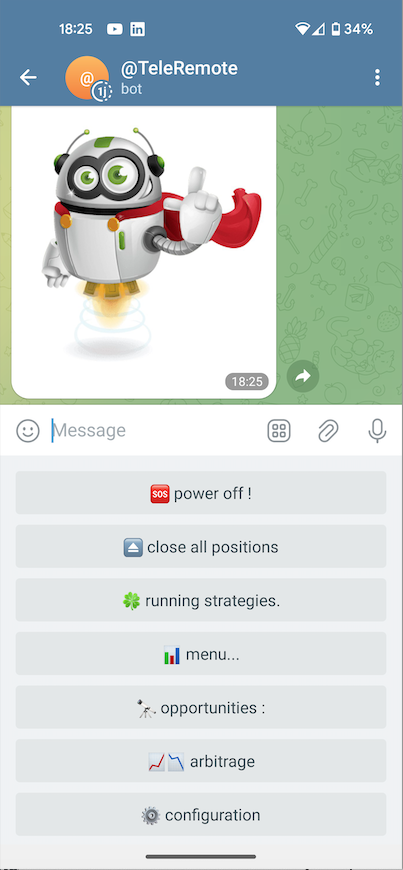
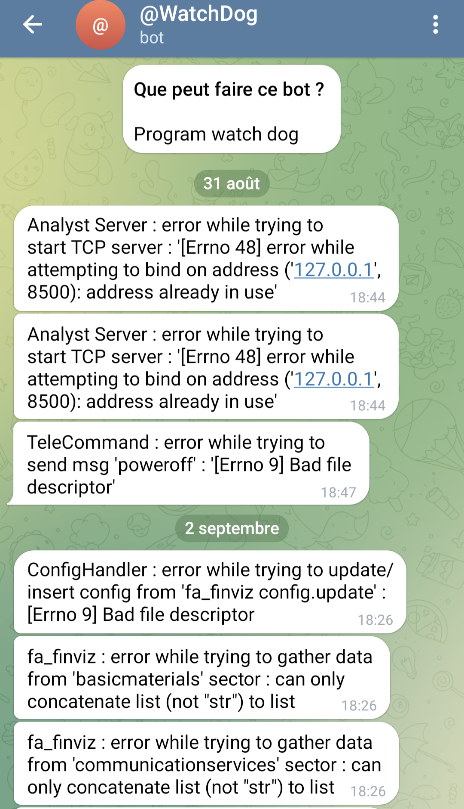
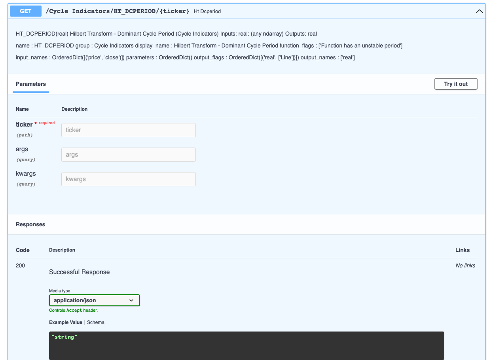
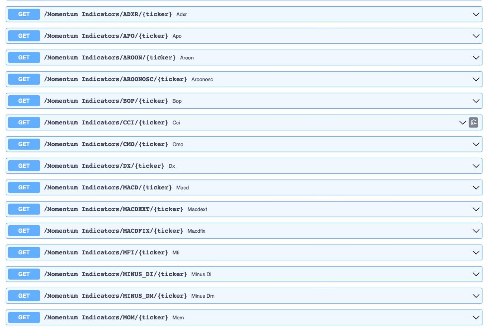

# HireMe

 
This is an exemple of some personal work done on my spare time, with the most recent addition using a chatGPT assistant.  
This is the starting point of a personal project which should finally become my trading plateform.
  
This project is/will be split in 5 main components : 
       - "common" shares the "core part" for all other parts  
       - "trading" make trades (operational part)  
       - "analyst" makes different types of analysis (technical, statistical, fundamental analysis...)  
       - "scrapy" scraps different data sources on the web  
       - "backtesting" makes tests with "portfolio rebalancing"  

 
The "common" part is finished, the others are still under construction.                                                                              
The project relies on Python's asyncio, flask, fastAPI, multiprocess, threads, sockets, socket-io, jupyter-lab, TA-lib, websocket, django  
(I have added the requirements.txt of the python virtual environment).

 

<h4>This current repo contains almost all  files of the "common" component </h4>

 
Real time Crypto Currency price :

  
A "kind of remote control" from smart phone :

  
A "watchdog" notifier on error, warning... :

 
Data analysis example from "Jupyter labs" : 

 
A FastAPI server to load datas, test and calculate realtime TA indicators (based on https://ta-lib.github.io/ta-lib-python/ also based on original TA-LIB c/c++) :

 
And some other things... (fundamental analysis on stocks, websockets, pseudo-arbitrage..., sometime integrated, sometime only snippets or not linked scripts)  

Will be continued... 
Thank you for taking times to take a look at my "draft" coding files ! 

